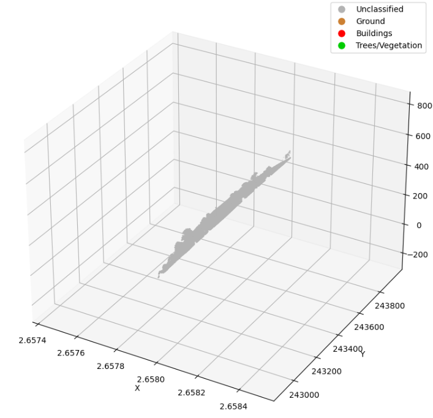
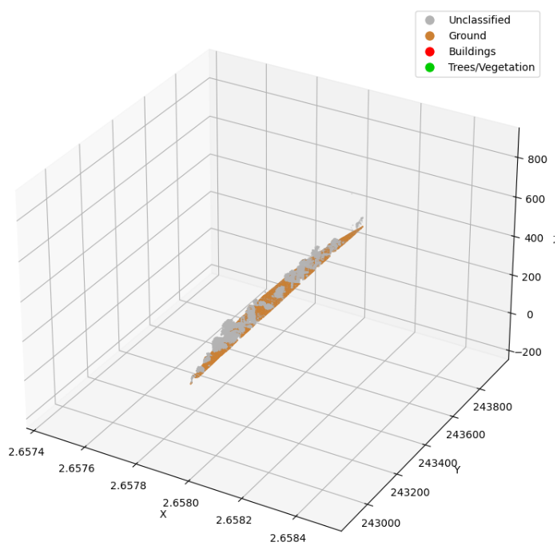
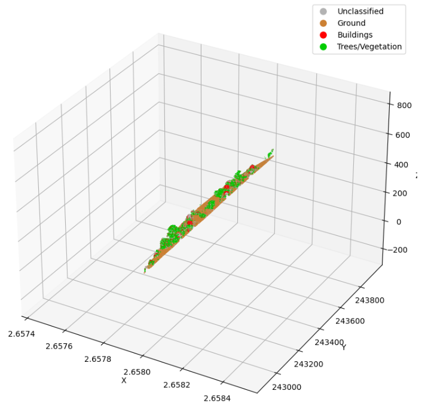
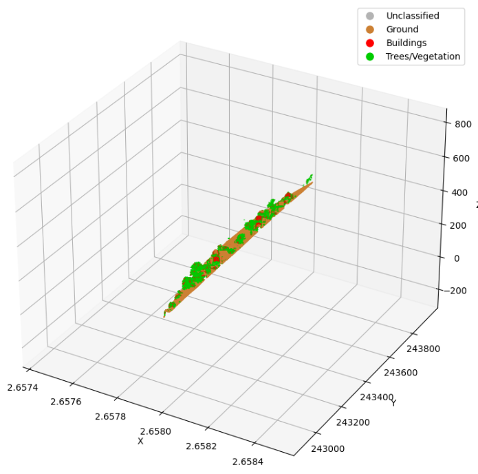

# Notebook for LiDAR Classification

A Python tool made in Jupyter Notebook for automatic classification of LiDAR point cloud data. Identifies ground, buildings and vegetation from raw LAS files.


## Open in GoogleColab
[](https://colab.research.google.com/github/beatrizbsperes/LiDARClassification/blob/main/LiDARClassificationRoutine_colab.ipynb)

## Features

- Processes standard LAS format LiDAR data
- Classifies points into ground, buildings and vegetation
- Optional downsampling for better performance 
- ML-based classification refinement with Random Forest
- 3D visualization with Matplotlib and Open3D
- Export to classified LAS files

## How It Works

1. **Load** LAS files with point coordinates and attributes
2. **Downsample** to reduce processing time (optional)
3. **Detect ground** using grid-based elevation and slope analysis
4. **Extract features** (height, density, planarity, sphericity, ...)
5. **Classify points** based on geometric properties of the extracted features
6. **Refine** with machine learning
7. **Visualize** and **Export** classified point cloud

## Classification Codes

- 0: Unclassified (gray)
- 1: Ground (brown)
- 2: Buildings (red)
- 3: Vegetation (green)




## Usage

```python
# Initialize and process
processor = LidarProcessor()
processor.load_file("input.las")
processor.downsample(voxel_size=0.2)
processor.extract_ground()
processor.segmentation()
processor.classify_points()
processor.refine_with_ml()

# View and save results
processor.visualize()  # or processor.visualize_with_open3d()
processor.export_result("classified.las")
```

## Requirements

- numpy, scipy, laspy, scikit-learn, matplotlib, open3d

